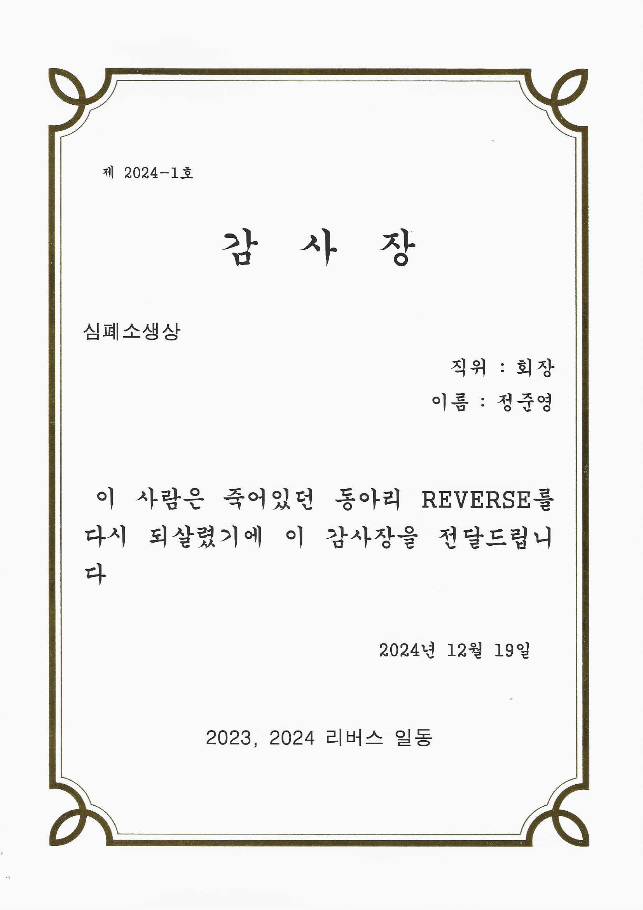

# Detailed Story of [Junyoung](https://github.com/junyoung011019)
## 📑 Table of Contents
 [**1. About Me**](#1-about-me)
  + [1.1. Profile](#11-profile)
  + [1.2. Educations](#12-educations)
  + [1.3. Skills](#13-main-tech-stack)
  + [1.4. Awards](#14-awards)
  + [1.5. REVERSE](#15-reverse)

 [**2. Projects**](#2-projects)
  + [2.1. 졸업작품 - AIoT 스마트홈](#21-aiot-스마트홈)
  + [2.2. 리버스 동아리 운영 프로젝트](#22-리버스-동아리)
  + [2.3. 미니게임 아케이드(C++)](#23-미니게임-아케이드)
  + [2.4. 기타 프로젝트](#24-기타-프로젝트)

<h1 id="1-about-me">1. About Me</h1>

## 1.1. Profile
이름 : 정 준영 (Jung Junyoung)

  - 생년월일 : 2001.10.19
  - 연락처 : 010-2842-5267
  - 이메일 : jungjunyoung1019@gmail.com
  - Github : https://github.com/junyoung011019
  - 자격증 : 정보처리기사(필기 합격), 네트워크 관리사 2급, KSQTB(SW 테스터), AWS SAA 준비중
  - 필 : 군필 (C4I 운용/정비병) 2021.07.28 ~ 23.01.27
  - MBTI : ENFP

## 1.2. Educations
남서울대학교, 2020-02 ~ 2025-08

  - 전공 : 컴퓨터소프트웨어학과
  - 학점 : 4.02 / 4.50 (3학년 2학기 기준)
    - 비고 : 조기 졸업

**클라우드 운영 역량까지 겸비한 백엔드 개발자**

 

💡 저는 이런 사람이 되고 싶습니다

저는 <strong>클라우드 운영 역량을 갖춘 백엔드 개발자</strong>가 되고 싶습니다.

다양한 교내외 프로젝트를 통해 팀 협업, DB 연동, API 설계 등 백엔드 전반을 직접 경험했습니다.

Spring Boot와 Node.js를 활용해 서비스를 개발했으며,  
실사용자 피드백을 기반으로 요구사항을 반영하고,  
애자일 방식으로 반복 개선하는 개발 사이클을 경험했습니다.

또한 온프레미스 서버의 한계를 체감하며  
클라우드 인프라(AWS, GCP)에 관심을 갖게 되었고,  
대부분의 프로젝트에서 클라우드 서버 구축과 운영을 주도했습니다.

이러한 경험을 바탕으로  
<strong>클라우드 운영 역량을 갖춘 백엔드 개발자</strong>로 성장하고자 합니다.

## 1.3. Main Tech STACK

### 🔧 Language

### 🌱 Framework & Library

### ☁️ DevOps & Infra

### 🛠 Tools

### 🗄️ Database

 

저는 **Java**와 **Python**을 주력 언어로 사용하며,  
**Spring Boot**를 중심으로 백엔드 개발 경험을 쌓았습니다.

단순한 개발을 넘어,  
**Linux 환경에서 서버 운영**,  
**AWS / GCP 기반 클라우드 인프라 관리**,  
**MySQL, MongoDB, Redis 등 다양한 DB 연동 경험**을 보유하고 있습니다.

## 1.4.  Awards

| 년도 | 활동명 | 수상 내용 | 활동 요약 | 주최/주관 |
|------|--------|-----------|------------|------------|
| 2023 | **SW 경진대회** | 대상 | [C++ & DB 연동 미니게임천국](#3-my-projects) | 컴퓨터소프트웨어학과 |
| 2024 | **이력서·자기소개서 경진대회** | 대상 | 개발자 직무 고민부터 서류·면접 준비까지 | 고용노동부, 대학일자리플러스센터 |
| 2022 | **대학생 안보 토론대회** | 8강 입상 | 양자 암호화를 이용한 단독망 구축 | 서울교육대학교, 육군사관학교 |
| 2023 | **개발 멘토링 - 3회 수상** | 우수상 | C언어 기초 멘토링 진행 | 학습지원센터, 교육혁신처장 |

## 1.5. REVERSE
**학과 코딩 리버스 동아리 요약**
- 3년간 학과 코딩 동아리 **리버스(REVERSE)** 운영  
- 학과 **[SW 경진대회 대상 수상](#3-my-projects)**, **교과 연계 성공 사례**  
- **30명 규모로 재구성**, 관심 분야별 **멘토링 체계화**  
- **후배에게 운영 이양**, 현재까지도 **지속적인 성장 중**

 동기와 후배에게 받은 심폐소생상 

> 📎 [3년간 함께한 개발 동아리, 끝이 아닌 새로운 연결](./about-club.md)

## 2. My Projects
### 2.1. AIoT Smart Home
#### 2.1.1 개요
주제 : 
역할 분배 : 
기간 : 
#### 2.1.2 
