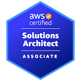

## 
👋 최적의 아키텍처를 설계하는 클라우드 엔지니어 정준영입니다.

다양한 <strong>클라우드 및 백엔드 프로젝트 경험 </strong>을 통해 개발자로서의 실력을 쌓아가고 있습니다.

단순히 인프라를 구축하는 것을 넘어, **비용 효율성(Cost Optimization)**과 **운영 안정성(Reliability)**을 최우선으로 고려하는 엔지니어입니다.
**백엔드(Spring Boot) 개발 경험**을 바탕으로 애플리케이션에서 코드 레벨까지 깊이 있게 파악합니다.

- Cloud Architecture: AWS/GCP 기반의 고가용성(HA) 아키텍처 설계 및 구축

- DevOps & Automation: CI/CD 파이프라인 구축 및 인프라 운영 자동화 경험

- Backend Engineering: Spring Boot/Node.js 개발 역량을 바탕으로 한 애플리케이션 레벨의 트러블슈팅

- 학과 코딩 동아리(REVERSE) 대표 (2023~2024)  

- 단순 기능 구현을 넘어, 효율적이고 능률적인 시스템 구조 설계

## ⭐ 주요 문서 바로가기

- 📂 **[프로젝트 상세 보기](./PROJECT.md)**
  
  → 클라우드 / 백엔드 기반 프로젝트 소개

- 👑 **[2025 Data Venture 문제 해결 챌린지 대상/부산광역시장상 수상](https://velog.io/@junyoung011019/2025-Data-Venture-1)**

- 🏆 **[2025 제 2회 전국 SW 경진대회 최우수상/총장상 수상](https://velog.io/@junyoung011019/swforum)**

- 🏠 **[성장 기록 블로그](https://velog.io/@junyoung011019)**

## Profile
이름 : 정 준영 (Jung Junyoung)

  - 생년월일 : 2001.10.19 (만 24세)
  - 연락처 : 010-2842-5267
  - 이메일 : jungjunyoung1019@gmail.com
  - 강점 : **리더십, 의사소통, 문제해결능력**
  - 학위 : 남서울대학교 컴퓨터소프트웨어학과 [GPA 4.06/4.5] (2020.03 ~ 2026.02)
  - 필 : 군필 (C4I 운용/정비병) 2021.07.28 ~ 23.01.27

  - 대표 자격증 :

| 자격 사항                              | 취득 일자     | 기관                         |
|---------------------------------------|--------------|------------------------------|
| [AWS Solution Architect - Associate](https://velog.io/@junyoung011019/AWS-Solutions-Architect-Associate-SAA)    | 2025.07.28   | Amazon Web Service           |
| 정보처리기사                           | 2025.06.13   | 한국산업인력공단              |
| 네트워크 관리사 2급                    | 2025.04.08   | 한국정보통신자격협회          |
| SQLD                    | 2025.09.19   | 한국데이터산업진흥원          |
| 리눅스 마스터 2급                    | 2025.10.03   | 한국정보통신진흥협회          |

    

## 저는 [&nbsp; 최적의 아키텍처를 설계하는 &nbsp;] 입니다.

저는 <strong>[ 최적의 아키텍처를 설계하는 클라우드 엔지니어 ]</strong> 입니다.

온프레미스 환경의 물리적 한계를 극복하기 위해  
**AWS Cloud Native 아키텍처**로의 전환을 주도하며,  
단순 구축을 넘어 **고가용성(HA) 설계와 비용 최적화**를 고민하는 엔지니어입니다.

**AWS Solutions Architect - Associate** 자격을 취득하여  
Well-Architected Framework 기반의 설계 원칙을 실무에 적용하고 있으며,  
**Serverless 파이프라인 구축 및 트래픽 제어(Auto Scaling)** 경험을 보유하고 있습니다.

또한 **Spring Boot와 Node.js 백엔드 개발 역량**을 바탕으로,  
인프라 이슈뿐만 아니라 **애플리케이션 레벨의 트러블슈팅**까지 가능하며,  
개발팀과 원활하게 소통할 수 있는 협업 능력을 갖췄습니다.

이러한 경험을 바탕으로  
<strong>먼저 클라우드 엔지니어로서 현장 운영과 구축 실무 역량을 탄탄히 쌓고,  
향후 고객의 비즈니스 성공을 이끄는 Solutions Architect(SA)로 성장하고자 합니다.</strong>

## 🚀 Junyoung's Skill Set

<table><tr>
<td valign="top" width="50%">

<h3 align="center">☁️ Cloud & DevOps (Main)</h3>

  
  
   
  
  
  
   
  
  
  

</td>
<td valign="top" width="50%">

<h3 align="center">☕ Backend & Database (Sub)</h3>

  
  
  
   
  
  
   
  
  
  

</td>
</tr></table>

**AWS와 GCP**를 활용한 클라우드 인프라 구축 및 운영을 주력으로 하며,  
**Docker, Jenkins**를 활용한 CI/CD 자동화 환경 구성 경험을 보유하고 있습니다.

또한 **Java(Spring Boot)와 Python** 개발 역량을 바탕으로,  
인프라 위에서 구동되는 애플리케이션의 동작 원리를 깊이 이해하고 최적화합니다.

## 수상 경험

| 년도 | 활동명 | 수상 내용 | 활동 요약 | 주최/주관 |
|------|--------|-----------|------------|------------|
| 2025 | [**Data Venture 문제 해결 챌린지**](https://velog.io/@junyoung011019/2025-Data-Venture-1) | **부산광역시장상 / 대상** | [Serverless 숏폼 외국어 회화 플랫폼](https://github.com/junyoung011019/aws-serverless-shortform-platform) | [AWS, 서울대학교 빅데이터 혁신융합대학](https://snuc.snu.ac.kr/%EA%B3%B5%EC%A7%80%EC%82%AC%ED%95%AD/document/298/) |
| 2025 | [**전국대학 소프트웨어 성과 공유포럼**](https://velog.io/@junyoung011019/swforum) | **최우수상 / 동아대학교 총장상** | [IoT 기반, 1인 가구 에너지 절감 시스템](https://github.com/junyoung011019/aiot_smart_home_spring) | [과학기술정보통신부, 부산광역시](https://linkareer.com/activity/247912) |
| 2023 | **SW 경진대회** | 대상 | [C++ & DB 연동 미니게임천국](https://github.com/junyoung011019/cpp-minigame-score) | 컴퓨터소프트웨어학과 |
| 2024 | **이력서·자기소개서 경진대회** | 대상 | 개발자 직무 고민부터 서류·면접 준비까지 | 고용노동부, 대학일자리플러스센터 |
| 2022 | **대학생 안보 토론대회** | 8강 입상 | 양자 암호화를 이용한 단독망 구축 | 서울교육대학교, 육군사관학교 |
| 2023 | **개발 멘토링 - 3회 수상** | 우수상 | C언어 기초 멘토링 진행 | 학습지원센터, 교육혁신처장 |
